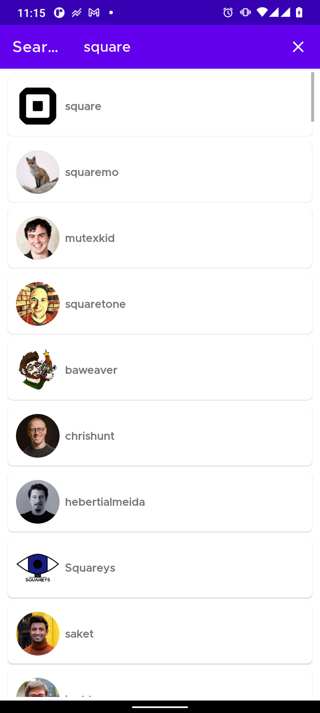
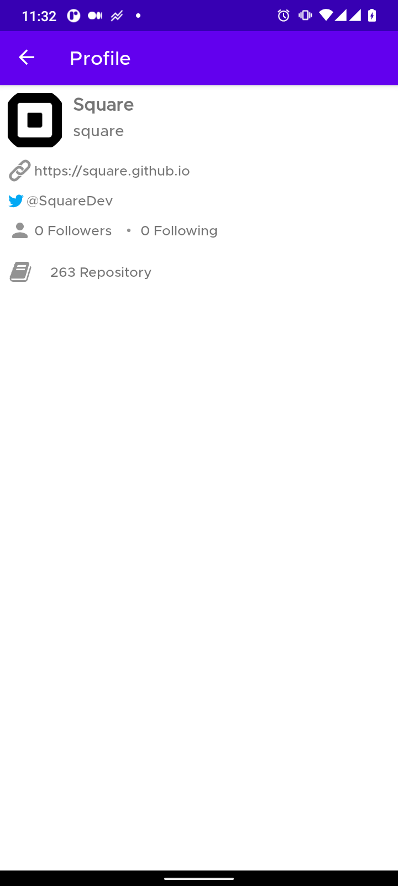
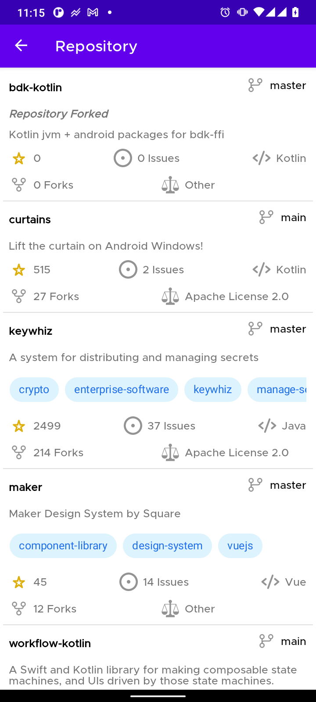
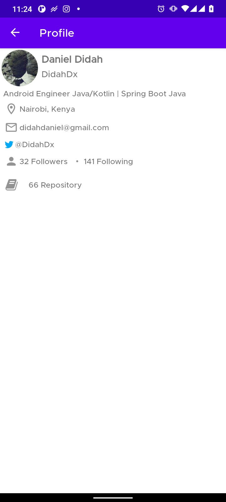
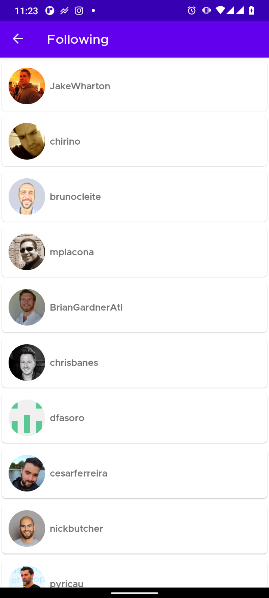
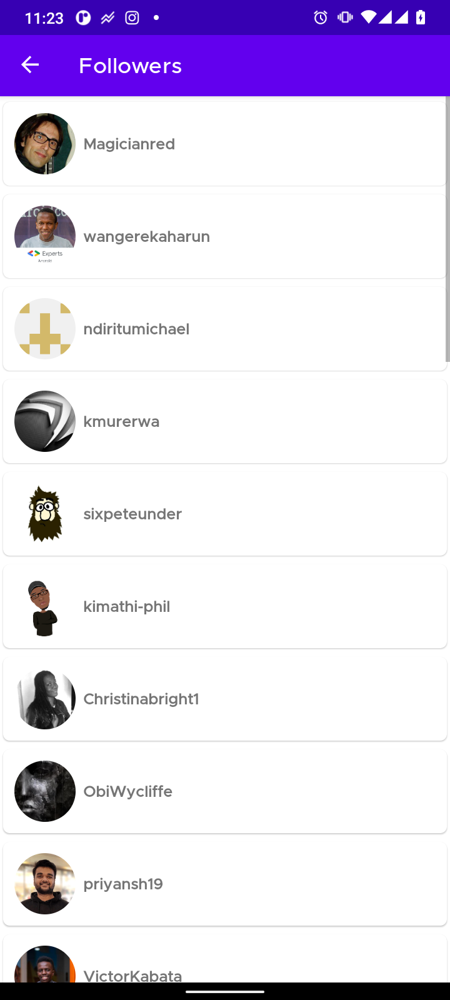

# GithubApp

- Demo Android application consuming the [github api](https://docs.github.com/en/rest)

## Setup

- You will need to generate the github token to make the project work. You can find the
  guide [here](https://docs.github.com/en/authentication/keeping-your-account-and-data-secure/creating-a-personal-access-token)

- Add the token to the local.properties it should similar to below.
  ``` GITHUB_TOKEN=REPLACE_THIS_WITH_YOUR_TOKEN_HERE  ```

## ScreenShots
   
 
  

## Libraries

Libraries used in the whole application are:

- [Viewmodel](https://developer.android.com/topic/libraries/architecture/viewmodel) - Manage UI
  related data in a lifecycle conscious way
- [Room](https://developer.android.com/training/data-storage/room) - Provides abstraction layer over
  SQLite
- [Kotlin.coroutines](https://developer.android.com/kotlin/coroutines?gclid=Cj0KCQjw1dGJBhD4ARIsANb6Odld-9wkN4Lkm6UJAvWRshusopwstZH5IXkSLzxv_Q5JYjgjozIywfcaAlS9EALw_wcB&gclsrc=aw.ds)
    - Concurrency design pattern that you can use on Android to simplify code that executes
      asynchronously.
- [Hilt](https://dagger.dev/hilt/quick-start.html) - Used for Dependency injection
- [Retrofit](https://square.github.io/retrofit/) - Turns your HTTP API into a Java interface.
- [Mockito](https://javadoc.io/doc/org.mockito/mockito-core/latest/org/mockito/Mockito.html) -
  Enables mock creation, verification and stubbing for testing
- [MockWebServer](https://github.com/square/okhttp/tree/master/mockwebserver) - A scriptable web
  server for testing HTTP clients
- [Glide](https://github.com/bumptech/glide) - Media management and image loading framework for
  Android